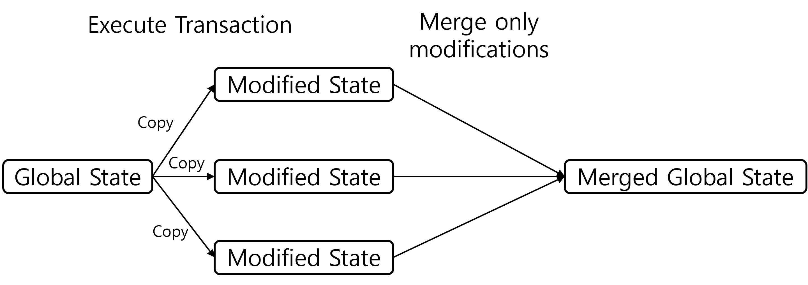

# Go-EVM

This repository is a module extracted from [go-ethereum (geth)](https://geth.ethereum.org/) Ver. 1.14 and made available to EVM only.  
This EVM doesn't test EOF(Ethereum Object Format)

## Table of Contents
- [Run on Example](#run-on-example)
- [Usage](#usage)
- [Other](#other)

---

## Run on Example

1. Compile Contract  
  
Whether you are using solc or Remix, you should have the *.abi and *.bin.

2. Run
```
$ cd example
$ go run main.go
```

## Usage

Before using the EVM, you'll need to customize loadBin( ), loadAbi( ), and setDefaults( ) functions for your setup, see the example.

### 1. Create State
```go
// If you use snapshot, this config must be used
snapconfig := snapshot.Config{
    CacheSize:  256,
    Recovery:   true,
    NoBuild:    false,
    AsyncBuild: false,
}

triedbConfig := &triedb.Config{
    Preimages: true,
    HashDB: &hashdb.Config{
        CleanCacheSize: 256 * 1024 * 1024,
    },
}

leveldb, _ := rawdb.NewLevelDBDatabase("../leveldb_path", 128, 1024, "", false)

// Create State
tdb := triedb.NewDatabase(leveldb, triedbConfig)
snaps, _ := snapshot.New(snapconfig, leveldb, tdb, types.EmptyRootHash)
statedb := state.NewDatabase(tdb, snaps) // If you don't use snapshot, snaps is null
globalstate, _ := state.New(types.EmptyRootHash, statedb)
```

You can use other database. [Details](#1-database)

### 2. Create Account
```go
testAddress := common.BytesToAddress([]byte("Random Value"))
globalstate.CreateAccount(testAddress)
```

### 3. Set Balance and Nonce
```go
globalstate.SetBalance(testAddress, uint256.NewInt(balance), tracing.BalanceChangeUnspecified)
globalstate.SetNonce(testAddress, nonce)
```

### 4. Create EVM
```go
cfg := SetDefaults(blockheight)
evm := runtime.NewEnv(cfg, globalstate)
```

### 5. Coin Transfer
```go
evm.Context.Transfer(globalstate, testAddress, testAddress2, uint256.NewInt(transfer_amount))
```

### 6. Contract Deploy
```go
data := loadBin("./bin_file_name")
sender := vm.AccountRef(testAddress)

returnValue, contractAddress, gasleftover, err := evm.Create(
    sender, // Deployer
    data, // Contract byte code
    globalstate.GetBalance(testAddress).Uint64(), // Gas
    uint256.NewInt(0), // msg.value
)
globalstate.SetBalance(testAddress, uint256.NewInt(gasleftover), tracing.BalanceChangeUnspecified) // Remaining balance after spending gas
```

### 7. Contract Execute
```go
abiObj := loadAbi("./abi_file_name")
sender := vm.AccountRef(testAddress)
data, err := abiObj.Pack("contract function name", input1, input2)

returnValue, gasleftover, err = evm.Call(
    sender, // Executer address
    contractAddress, // Contract Address(CA)
    data, // Instruction
    globalstate.GetBalance(testAddress).Uint64(), // Gas
    uint256.NewInt(msg.value), // msg.value
)
globalstate.SetBalance(addrArray[i], uint256.NewInt(gasleftover-uint64(msg.value)), tracing.BalanceChangeUnspecified) // Remaining balance after spending gas
```

### 8. Get Balance and State Variable
```go
globalstate.GetBalance(testAddress) // Get Balance

// Function to get the hash value of a variable in state storage owned by a contract, 
// depending on how state variables are stored in Ethereum.
func CalculateMappingSlotIndex(address common.Address, slot uint64) []byte {
    // left pad address with 0 to 32 bytes
    addressBytes := common.LeftPadBytes(address.Bytes(), 32)
    // left pad slot with 0 to 32 bytes
    slotBytes := make([]byte, 32)
    binary.BigEndian.PutUint64(slotBytes[24:], slot)
    return crypto.Keccak256(addressBytes, slotBytes)
}
deployinitstate.GetState(contractAddress, common.Hash(CalculateMappingSlotIndex(testAddress, slot_num))) // Get State
```

### 9. Commit State
```go
rootHash, _ = globalstate.Commit(block_num, true, layer_num) // State Commit
if err := tdb.Commit(rootHash, false); err != nil { // Write committed state to disk
    panic(err)
}
```

---

## Other

### 1. Database  
You can use pebbledb and memory instead of leveldb.

- Use PebbleDB
```go
pebbledb, _ := rawdb.NewPebbleDBDatabase("../pebbledb_path", 128, 1024, "", false)
```
- Use Memory
```go
memdb := rawdb.NewMemoryDatabase()
```
If you want to use a different DB, you can create a new database in db/ethdb with the ethdb.KeyValueStore interface and create a NewOtherDB( ) in rawdb/database.go.

### 2. Trie  
Ethereum uses MPT(Merkle Patricia trie).  
If you want to modify this, you can modify the trie directory to match the Trie interface in state/database.go.

### 3. Snapshot  
When [commit state](#9-commit-state), if snapshot is not used, the value of layer_num can be any value.  
Otherwise, you'll need to adjust the value of layer_num, which determines how many commits later a snapshot is taken.

### 4. EVM Parallel Execution  
If you want to run EVM in parallel, you can implement it as shown below. Using state.Copy( )  
